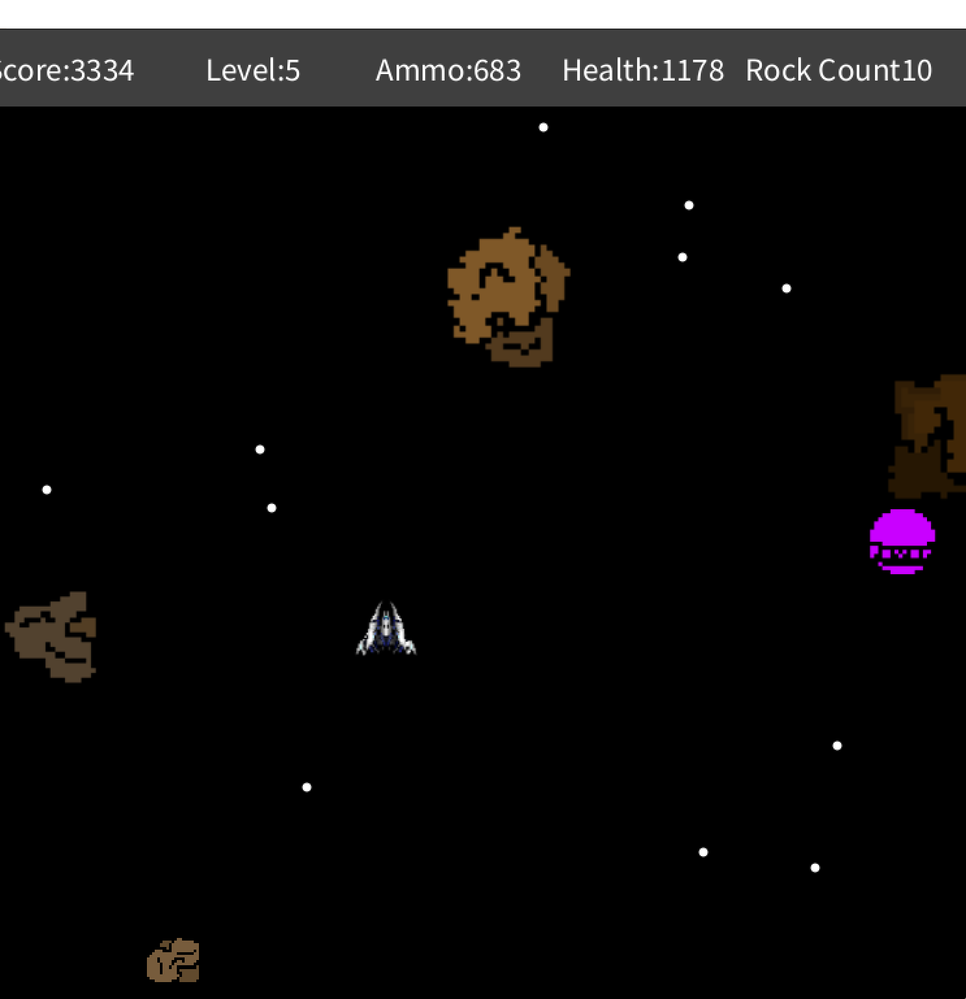
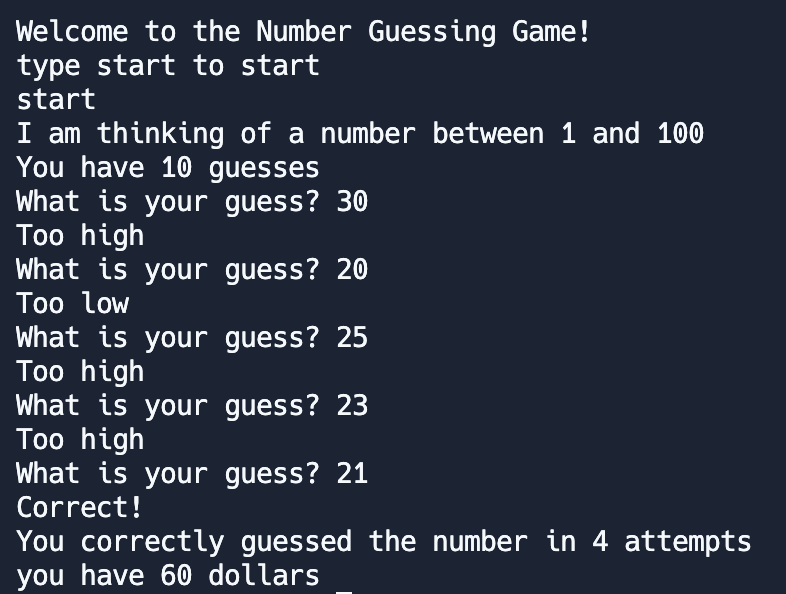
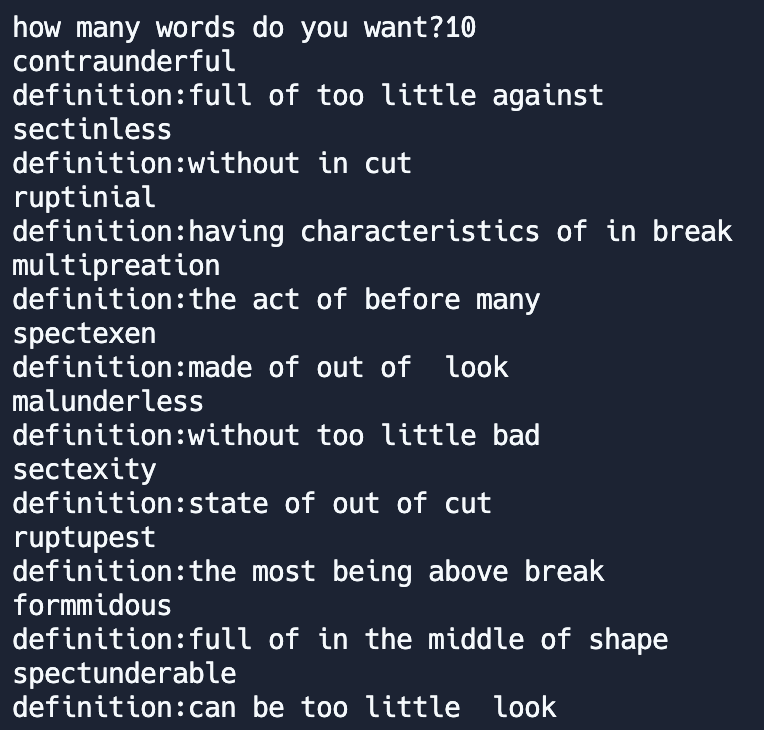
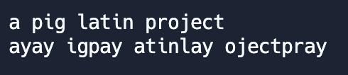
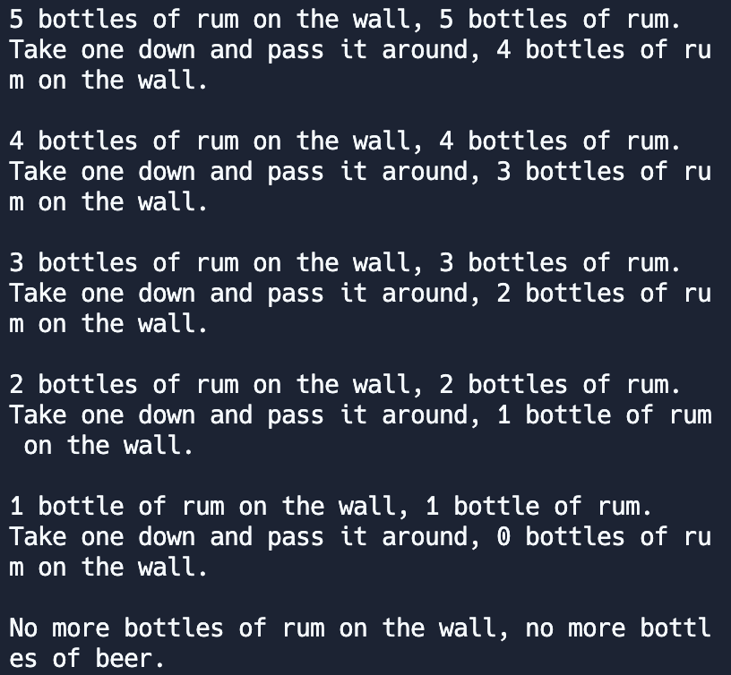
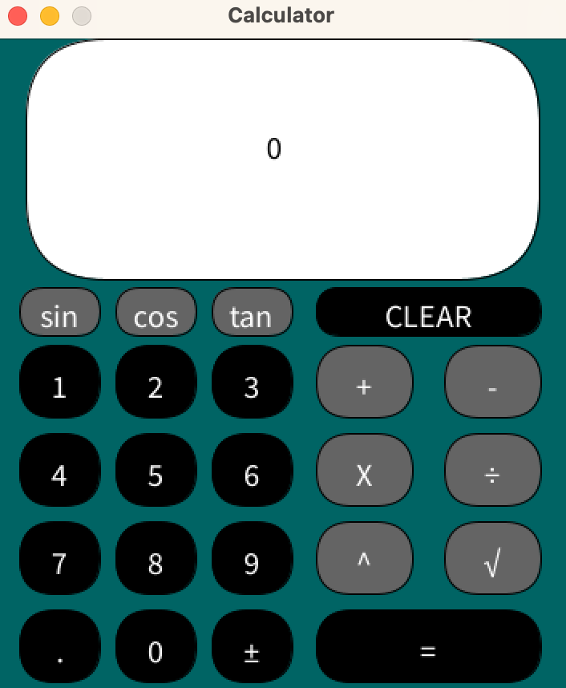
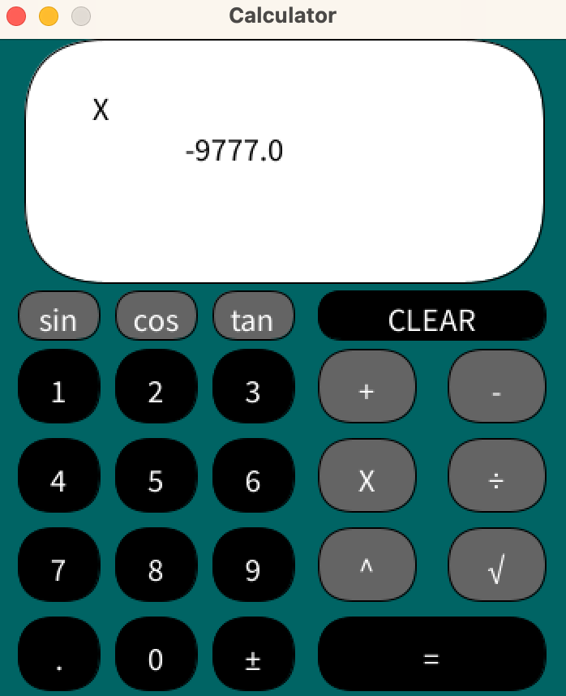

# Grayson Carter's Programming Portfolio 2024

## Tech Certifications
*Digital Media 1 State Certification

[Digital Media 1](https://github.com/goober42/programmingportfolio/blob/main/images/graphiccert.pdf)

*Java Coding State Certification

[Java State Cert](https://github.com/goober42/programmingportfolio/blob/main/images/programcert.pdf)

## Group Project

## Individual Projects

### SpaceGame
OOP graphical game using sound and images for a full user experience.

[Source Code](https://github.com/goober42/programmingportfolio/blob/main/src/SpaceGame.zip)

### Number Guessing Game
Python code that makes you guess a number between 1 and 100

[Source Code](https://github.com/goober42/programmingportfolio/blob/main/src/main%20(4).py)

### Random Word Generator
Python code built around a list of prefixes, suffixes, roots, and their respective definitions that compiles them at random, and assigns an accurate description.

[Source Code](https://github.com/goober42/programmingportfolio/blob/main/src/wordgen.py)

### Pig Latin Translator
Python code that takes a sentence in English and makes it pig latin

[Source Code](https://github.com/goober42/programmingportfolio/blob/main/src/piglatin.py)

### 99 Bottles App
App that "sings" the 99 bottles song with a changable starting amount of bottles.

[Source Code](https://github.com/goober42/programmingportfolio/blob/main/src/bottles.py)

### Calculator App
Java-coded calculator.

[Source Code](https://github.com/goober42/programmingportfolio/blob/main/src/Calculator.zip)

